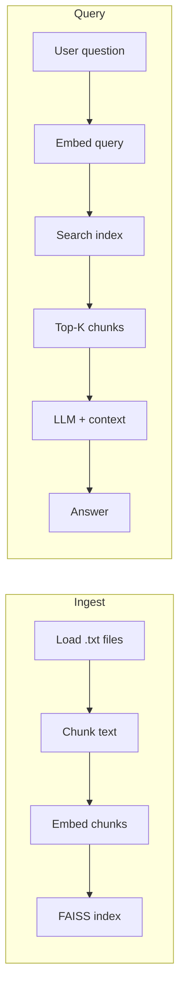
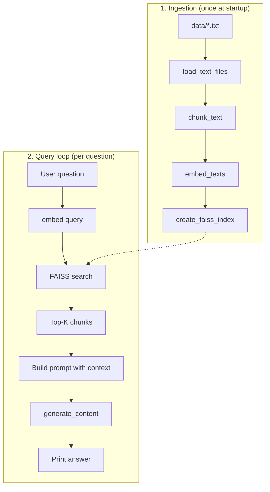
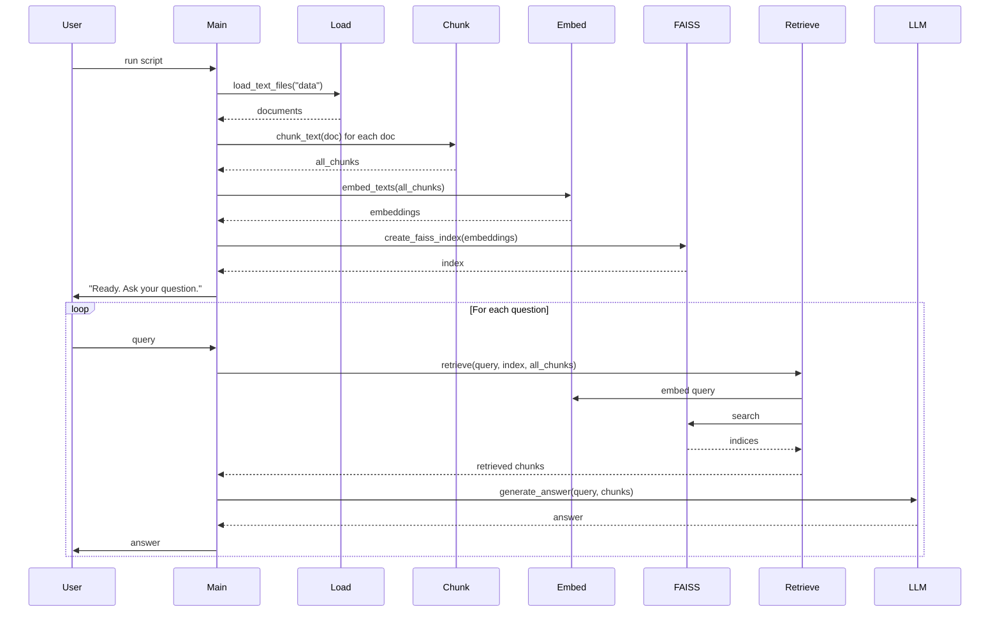

# RAG Tutorial: Basic Pipeline (rag.py)

**Structure:** Part 1 gives a high-level understanding in blocks. Part 2 goes into detailed steps, code references, and diagrams.

---

## Part 1 — High level

### Overview: RAG in blocks

Think of RAG as a few connected blocks. Each block has one job; together they let the LLM answer from *your* documents instead of only its training data.

| Block | What it is | What it does |
|-------|------------|---------------|
| **1. Your documents** | The raw content (e.g. `.txt` files in a folder). | Source of truth. Everything the system “knows” comes from here. |
| **2. Indexing** | A one-time preparation step. | Documents are split into chunks, turned into vectors (embeddings), and stored in a search index. After this, the system can find “which chunks are similar to a question?” |
| **3. Query** | The user’s question. | Same as any search: user asks something in natural language. |
| **4. Retrieval** | Search over the index. | The question is turned into a vector; the index returns the few chunks most similar to that vector. Those chunks are the only context the LLM will see. |
| **5. Generation** | The LLM’s reply. | The model gets the question plus the retrieved chunks and produces an answer using *only* that context. |

**In one line:** Index your docs once → for each question, retrieve the best chunks → send chunks + question to the LLM → get an answer.



---

### High-level process flow



---

## Part 2 — Detailed

Below is a step-by-step walkthrough of each part of the pipeline and how it appears in code.

### 1. Load documents (`load_text_files`)

**Purpose:** Read all plain-text content from a folder so it can be chunked and embedded.

**What the code does:**

- Scans the given folder (e.g. `data/`) for filenames ending in `.txt`.
- Opens each file with UTF-8 encoding and appends its full text to a list.
- Returns a list of strings (one string per file).

**Flow:**

```
data/
  refund-policy.txt   -->  "Full refund within 30 days..."
  ivo-biography.txt   -->  "Ivo is a developer..."
         |
         v
  documents = [doc1, doc2, ...]
```

**Relevant code:** Lines 12–18 in `rag.py`. No embedding or chunking yet—only file I/O.

---

### 2. Chunk text (`chunk_text`)

**Purpose:** Split long documents into smaller segments (chunks) so that:

- Each chunk fits within embedding/model limits.
- Retrieval returns focused passages instead of whole files.
- Overlap reduces the risk of splitting important sentences in the middle.

**What the code does:**

- Slides a window of `chunk_size` characters (default 500) over the text.
- After each chunk, the window moves forward by `chunk_size - overlap` (default 400), so consecutive chunks overlap by `overlap` characters (100).
- Returns a list of strings (the chunks).

**Parameters:**

| Parameter     | Default | Meaning                          |
|---------------|---------|----------------------------------|
| `chunk_size`  | 500     | Length of each chunk in characters |
| `overlap`     | 100     | Shared characters between consecutive chunks |

**Overlap (ASCII):**

```
Document: "Lorem ipsum dolor sit amet, consectetur adipiscing elit..."

Chunk 1:  [0    .............. 500]
Chunk 2:        [400 .............. 900]   (overlap 100 chars)
Chunk 3:              [800 .............. 1300]
```

**Relevant code:** Lines 21–28. Called once per document in `main`; all chunks are concatenated into `all_chunks`.

---

### 3. Embed texts (`embed_texts`)

**Purpose:** Turn each chunk into a fixed-size vector (embedding) so that semantically similar text has similar vectors and can be found by similarity search.

**What the code does:**

- For each chunk string, calls the Gemini API `embed_content` with model `gemini-embedding-001`.
- The API returns one embedding per content item; the code takes `response.embeddings[0].values`.
- Collects these into a NumPy array of shape `(num_chunks, embedding_dim)` and casts to `float32` for FAISS.

**Conceptual flow:**

```
Chunk 1  -->  API  -->  [0.12, -0.34, 0.56, ...]   (e.g. 768 dims)
Chunk 2  -->  API  -->  [0.01,  0.22, -0.11, ...]
...
         |
         v
  embeddings: shape (N, D)
```

**Relevant code:** Lines 32–41. Used at ingest time for all chunks and at query time inside `retrieve` for the user question.

---

### 4. Create FAISS index (`create_faiss_index`)

**Purpose:** Build a search structure so that, given a query vector, you can quickly find the K nearest chunk vectors (by L2 distance).

**What the code does:**

- Reads the embedding dimension from `embeddings.shape[1]`.
- Creates a `faiss.IndexFlatL2(dimension)` index (exact L2 search, no approximate search).
- Adds all chunk embeddings with `index.add(embeddings)`.

**Why FAISS:** Fast similarity search over many vectors; the script uses the CPU index (`faiss-cpu`). L2 distance is used as the similarity measure (smaller distance = more similar).

**Relevant code:** Lines 44–48. Index is built once after `embed_texts(all_chunks)` and reused for every query.

---

### 5. Retrieve (`retrieve`)

**Purpose:** For a user question, get the K chunks whose embeddings are closest to the question’s embedding.

**What the code does:**

1. Embed the query string with the same model and API as the chunks.
2. Reshape the query embedding to a single row and cast to `float32`.
3. Call `index.search(query_vector, top_k)` (default `top_k=3`).
4. FAISS returns distances and indices; the code uses the indices to select the corresponding chunks from the `chunks` list.
5. Returns a list of K chunk strings.

**Flow:**

```
User query  -->  embed_content  -->  query_vector
                      |
                      v
              index.search(query_vector, top_k=3)
                      |
                      v
              indices = [2, 0, 5]   (example)
                      |
                      v
              [chunks[2], chunks[0], chunks[5]]
```

**Relevant code:** Lines 51–61. Called once per user question in the main loop.

---

### 6. Generate answer (`generate_answer`)

**Purpose:** Use the LLM to produce an answer that is grounded in the retrieved chunks only.

**What the code does:**

1. Joins the retrieved chunk strings with double newlines into a single `context` string.
2. Builds a prompt that instructs the model to answer using only that context, plus the user’s question.
3. Calls `client.models.generate_content` with model `gemini-2.5-flash` and the prompt.
4. Returns `response.text` (the model’s reply).

**Prompt shape:**

```
Answer the question using ONLY the context below.

Context:
<chunk 1>

<chunk 2>

<chunk 3>

Question:
<user query>
```

**Relevant code:** Lines 64–84. Called after `retrieve` in the main loop.

---

## Main Program Flow

The `if __name__ == "__main__"` block (lines 87–112) wires everything together:



**Step-by-step:**

1. **Ingest:** Load all `.txt` from `data/` → chunk each document → embed all chunks → build FAISS index.
2. **Loop:** Read a question from the user; if "exit", stop. Otherwise: retrieve top-K chunks, call `generate_answer`, print the answer, then prompt again.

---

## Data Flow Summary (ASCII)

```
                    INGESTION
  ┌─────────┐    ┌─────────┐    ┌─────────┐    ┌─────────┐
  │ .txt    │ -> │ Chunk   │ -> │ Embed   │ -> │ FAISS   │
  │ files   │    │ (500/100)│    │ (API)   │    │ index   │
  └─────────┘    └─────────┘    └─────────┘    └────┬────┘
                                                     │
                    QUERY                             │
  ┌─────────┐    ┌─────────┐    ┌─────────┐          │
  │ User    │ -> │ Embed   │ -> │ Search  │ <────────┘
  │ question│    │ query   │    │ index   │
  └─────────┘    └─────────┘    └────┬────┘
                                     │
                                     v
  ┌─────────┐    ┌─────────┐    top-K chunks
  │ Print   │ <- │ LLM     │ <- (context + question)
  │ answer  │    │ generate│
  └─────────┘    └─────────┘
```

---

## Environment and Dependencies

- **API key:** Set `GOOGLE_API_KEY` in `.env` (or environment). Used for both embedding and generate APIs.
- **Dependencies:** See `requirements.txt`—notably `numpy`, `faiss-cpu`, `python-dotenv`, and `google-genai`.

Run the pipeline:

```bash
pip install -r requirements.txt
python rag.py
```

After "Ready. Ask your question.", type a question (e.g. about your refund policy or biography); the script will retrieve relevant chunks and answer using only that context.
