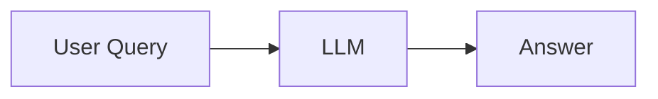
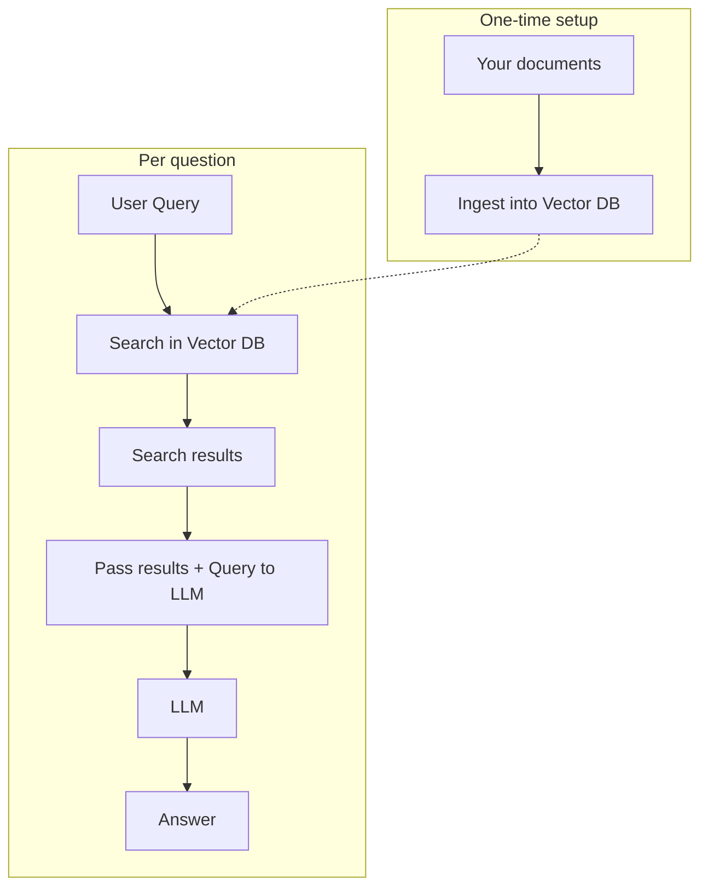
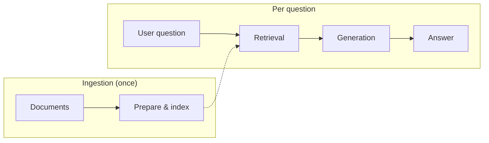
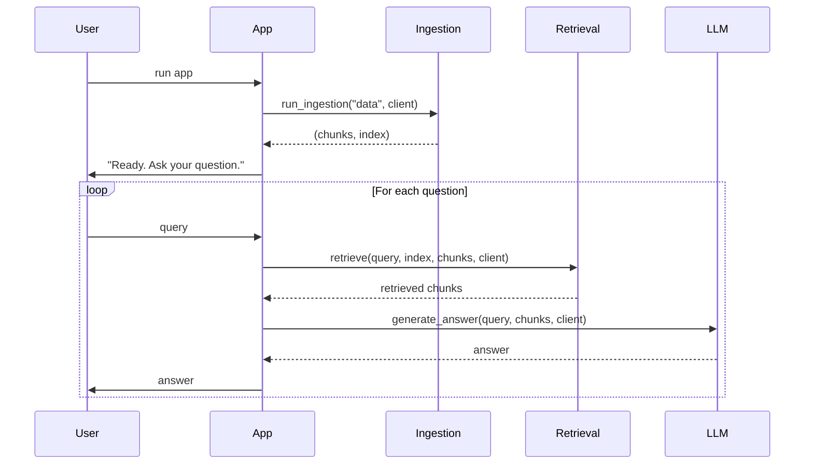

# RAG Tutorial: Basic Pipeline

This tutorial is in **three parts**: a short overview with diagrams, a high-level view of the steps (mapped to lab-01), and a detailed walkthrough of each step and the code.

---

## 1) Overview

RAG (Retrieval-Augmented Generation) means: instead of asking the LLM to answer from memory alone, you **search your own documents** and **give the model only the relevant bits** when it answers. Below is how that differs from a normal LLM, in simple flows.

### How a normal LLM works

The user asks a question; the model answers from what it was trained on. No search, no your-docs context.



### How RAG works

You do a **one-time setup**: ingest your documents into a **vector store** (searchable index). Then, for each question, you **search** that store, and send the **search results plus the question** to the LLM. The answer is based on your documents, not only on the model’s training.



**In one line:** Ingest your docs once → for each question, search the vector DB → send retrieved text + question to the LLM → get an answer.

---

## 2) High Level

RAG breaks down into a few steps. Here they are as blocks, and how they map to **lab-01** (see [lab-01-step-by-step.md](lab-01-step-by-step.md) for the full flow and setup).

| Step | What it does | In lab-01 |
|------|----------------|-----------|
| **Ingestion** | Load documents, prepare them, and build a searchable index. Run **once** at startup. | `ingestion.py`: `run_ingestion("data", client)` loads `data/*.txt`, chunks and embeds them, builds a FAISS index. |
| **Retrieval** | For each user question, search the index and return the most relevant pieces of text. | `retrieval.py`: `retrieve(query, index, chunks, client)` embeds the query, searches the index, returns top-K chunks. |
| **Generation** | Take the retrieved chunks + the question, send them to the LLM, return the answer. | `generation.py`: `generate_answer(query, retrieved_chunks, client)` builds a prompt and calls the LLM. |
| **Answer** | The LLM’s reply, grounded in the retrieved context. | Printed in the main loop in `app.py`. |

High-level flow in blocks:



**In lab-01:**

- **`app.py`** — Loads config, runs `run_ingestion("data", client)` once, then loops: read question → `retrieve(...)` → `generate_answer(...)` → print answer.
- **`ingestion.py`** — Load files, chunk, embed, build FAISS index (see [lab-01-step-by-step.md](lab-01-step-by-step.md) Phase 4).
- **`retrieval.py`** — Embed query, search index, return top-K chunks (Phase 5).
- **`generation.py`** — Build prompt from chunks + question, call Gemini, return text (Phase 6).

We do **not** go into how chunking or vectors work here; that’s in **Section 3 (Detailed)**.

---

## 3) Detailed

This section goes step-by-step through each part of the pipeline and how it appears in the **lab-01** code (and in the older single-file `rag.py` style where relevant). Here we explain chunking, embeddings, and the vector index.

### 3.1 Load documents

**Purpose:** Read all `.txt` files from a folder so they can be chunked and embedded.

**What the code does:** Scans the folder (e.g. `data/`), opens each `.txt` with UTF-8, appends its text to a list. Returns a list of strings (one per file). No chunking or embedding yet.

**In lab-01:** `ingestion.py` → `load_text_files(folder_path)`.

```
data/
  workshop-schedule.txt   -->  "Day 1 — Introduction..."
  ivo-biography.txt       -->  "Ivo is a developer..."
         |
         v
  documents = [doc1, doc2, ...]
```

---

### 3.2 Chunk text

**Purpose:** Split long documents into smaller segments (chunks) so that each chunk fits embedding/model limits and retrieval returns focused passages. Overlap helps avoid cutting sentences in the middle.

**What the code does:** Slides a window of `chunk_size` characters (e.g. 500) over the text; after each chunk, the window moves by `chunk_size - overlap` (e.g. 400), so consecutive chunks overlap (e.g. 100 characters). Returns a list of chunk strings.

**In lab-01:** `ingestion.py` → `chunk_text(text, chunk_size=500, overlap=100)`.

**Parameters:**

| Parameter    | Default | Meaning |
|-------------|---------|---------|
| `chunk_size`| 500     | Length of each chunk in characters |
| `overlap`   | 100     | Shared characters between consecutive chunks |

**Overlap (concept):**

```
Document: "Lorem ipsum dolor sit amet, consectetur..."

Chunk 1:  [0    .............. 500]
Chunk 2:        [400 .............. 900]   (overlap 100 chars)
Chunk 3:              [800 .............. 1300]
```

---

### 3.3 Embed texts

**Purpose:** Turn each chunk into a fixed-size vector (embedding) so that semantically similar text has similar vectors and can be found by similarity search.

**What the code does:** For each chunk, calls the Gemini API `embed_content` with model `gemini-embedding-001`. Collects the returned vectors into a NumPy array, shape `(num_chunks, embedding_dim)`, cast to `float32` for FAISS.

**In lab-01:** `ingestion.py` → `embed_texts(all_chunks, client)`.

```
Chunk 1  -->  API  -->  [0.12, -0.34, 0.56, ...]   (e.g. 768 dims)
Chunk 2  -->  API  -->  [0.01,  0.22, -0.11, ...]
         |
         v
  embeddings: shape (N, D)
```

---

### 3.4 Create vector index (FAISS)

**Purpose:** Build a search structure so that, given a query vector, you can quickly find the K nearest chunk vectors (by L2 distance).

**What the code does:** Reads embedding dimension from `embeddings.shape[1]`, creates `faiss.IndexFlatL2(dimension)`, adds all chunk embeddings with `index.add(embeddings)`. Smaller L2 distance = more similar.

**In lab-01:** `ingestion.py` → `create_faiss_index(embeddings)`. Index is built once and reused for every query.

---

### 3.5 Retrieve

**Purpose:** For a user question, get the K chunks whose embeddings are closest to the question’s embedding.

**What the code does:** (1) Embed the query with the same model as the chunks. (2) Reshape to a single row, `float32`. (3) Call `index.search(query_vector, top_k)`. (4) Use returned indices to pick the corresponding chunks. (5) Return the list of K chunk strings.

**In lab-01:** `retrieval.py` → `retrieve(query, index, chunks, client, top_k=3)`.

```
User query  -->  embed_content  -->  query_vector
                      |
                      v
              index.search(query_vector, top_k=3)
                      |
                      v
              indices = [2, 0, 5]   (example)
                      |
                      v
              [chunks[2], chunks[0], chunks[5]]
```

---

### 3.6 Generate answer

**Purpose:** Have the LLM answer using **only** the retrieved chunks as context.

**What the code does:** Joins the retrieved chunks into one `context` string. Builds a prompt: “Answer using ONLY the context below” + context + question. Calls `client.models.generate_content` (e.g. `gemini-2.5-flash`) and returns the reply text.

**In lab-01:** `generation.py` → `generate_answer(query, retrieved_chunks, client)`.

**Prompt shape:**

```
Answer the question using ONLY the context below.

Context:
<chunk 1>

<chunk 2>

Question:
<user query>
```

---

### 3.7 Main program flow

**In lab-01** (`app.py`): Load API key → run `run_ingestion("data", client)` once → loop: read question → `retrieve(...)` → `generate_answer(...)` → print answer. Exit when user types `exit`.



**Data flow (ASCII):**

```
                    INGESTION
  ┌─────────┐    ┌─────────┐    ┌─────────┐    ┌─────────┐
  │ .txt    │ -> │ Chunk   │ -> │ Embed   │ -> │ FAISS   │
  │ files   │    │ (500/100)│    │ (API)   │    │ index   │
  └─────────┘    └─────────┘    └─────────┘    └────┬────┘
                                                     │
                    QUERY                            │
  ┌─────────┐    ┌─────────┐    ┌─────────┐          │
  │ User    │ -> │ Embed   │ -> │ Search  │ <────────┘
  │ question│    │ query   │    │ index   │
  └─────────┘    └─────────┘    └────┬────┘
                                     │
                                     v
  ┌─────────┐    ┌─────────┐    top-K chunks
  │ Print   │ <- │ LLM     │ <- (context + question)
  │ answer  │    │ generate│
  └─────────┘    └─────────┘
```

---

### Environment and dependencies

- **API key:** Set `GOOGLE_API_KEY` in `.env` (or environment). Used for both embedding and generation.
- **Dependencies:** See `lab-01/requirements.txt` — e.g. `numpy`, `faiss-cpu`, `python-dotenv`, `google-genai`.

Run the pipeline (from `lab-01/`):

```bash
pip install -r requirements.txt
python app.py
```

After “Ready. Ask your question.”, try questions that match your documents (e.g. workshop schedule or speaker info); the system retrieves relevant chunks and answers using only that context. See [lab-01-step-by-step.md](lab-01-step-by-step.md) for full setup and example questions.
